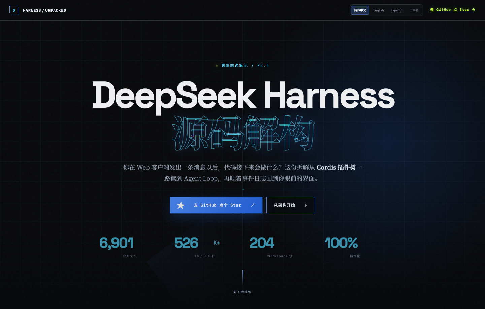
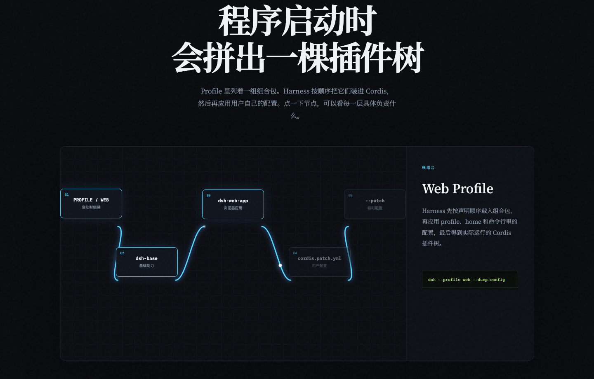
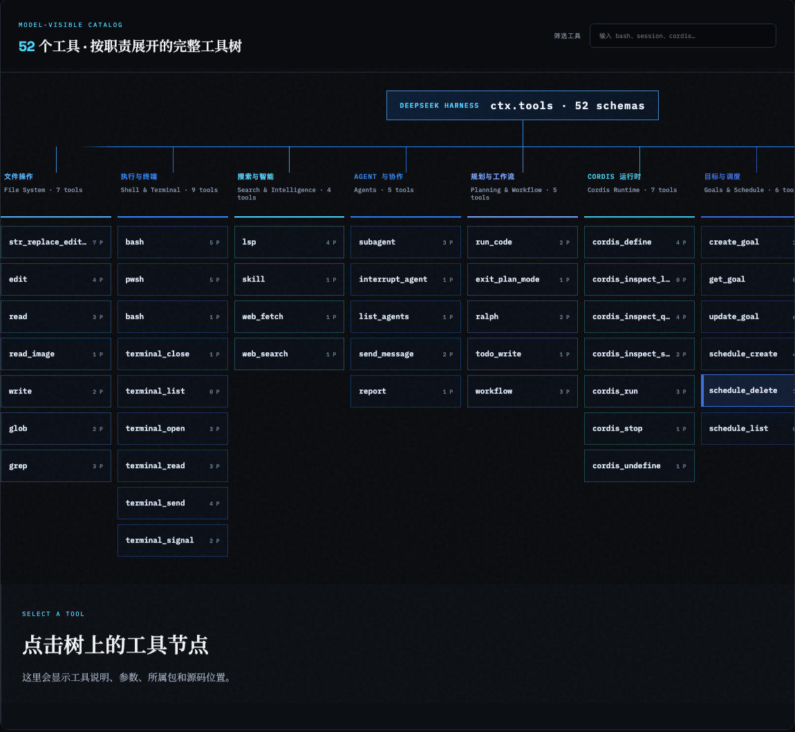

# DeepSeek Harness Unpacked

[简体中文](README.md) · [English](README.en.md) · [Español](README.es.md) · [日本語](README.ja.md)

一个支持简体中文、英文、西班牙语和日语的 DeepSeek Harness Web 客户端交互式源码解析站。

## 在线阅读

**[打开 DeepSeek Harness Unpacked →](https://ezrayfranklin-commits.github.io/deepseek-harness-unpacked/)**

## 网站内容

- 沿着真实源码拆解 Cordis 插件树和 Web Profile
- 用动画还原一条消息经过 Agent Loop 的完整过程
- 按职责浏览 52 个工具及其参数、插件包和源码位置
- 查看 Web 客户端注册的命令和推荐的源码阅读路线
- 在页面顶部随时切换简体中文、English、Español 和日本語

## 网站截图







## 本地运行

```bash
npm install
npm run dev
```

## 构建

```bash
npm run build
```

内容基于 [deepseek-ai/deepseek-harness](https://github.com/deepseek-ai/deepseek-harness) 公开源码与架构文档，属于非官方解读。
